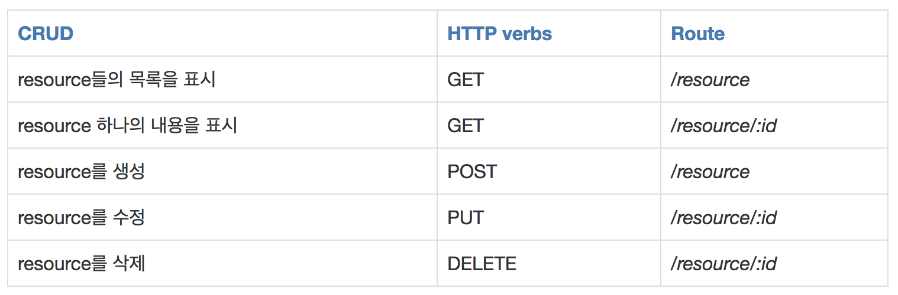

# REST API

## REST API란

* API(Application Programming Interface)란
  * 데이터와 기능의 집합을 제공하여 컴퓨터 프로그램간 상호작용을 촉진하며, 서로 정보를 교환가능 하도록 하는 것
* REST API의 정의
  * REST 기반으로 서비스 API를 구현한 것
  * 최근 OpenAPI(누구나 사용할 수 있도록 공개된 API: 구글 맵, 공공 데이터 등), 마이크로 서비스(하나의 큰 애플리케이션을 여러 개의 작은 애플리케이션으로 쪼개어 변경과 조합이 가능하도록 만든 아키텍처) 등을 제공하는 업체 대부분은 REST API를 제공한다.

## REST API의 특징

* 사내 시스템들도 REST 기반으로 시스템을 분산해 확장성과 재사용성을 높여 유지보수 및 운용을 편리하게 할 수 있다.
* REST는 HTTP 표준을 기반으로 구현하므로, HTTP를 지원하는 프로그램 언어로 클라이언트, 서버를 구현할 수 있다.
* 즉, REST API를 제작하면 델파이 클라이언트 뿐 아니라, 자바, C#, 웹 등을 이용해 클라이언트를 제작할 수 있다.

## REST API 설계 예시




# RESTful의 개념

## RESTful이란

* RESTful은 일반적으로 REST라는 아키텍처를 구현하는 웹 서비스를 나타내기 위해 사용되는 용어이다

## RESTful의 목적

* 이해하기 쉽고 사용하기 쉬운 REST API를 만드는 것
* RESTful한 API를 구현하는 근본적인 목적이 성능 향상에 있는 것이 아니라 일관적인 컨벤션을 통한 API의 이해도 및 호환성을 높이는 것이 주 동기이니, 성능이 중요한 상황에서는 굳이 RESTful한 API를 구현할 필요는 없다.

## RESTful 하지 못한 경우

1. CRUD 기능을 모두 POST로만 처리하는 API
2. route에 resource, id 외의 정보가 들어가는 경우(/students/updateName)
   https://gmlwjd9405.github.io/2018/09/21/rest-and-restful.html


# DRF

> Django REST Framework

## DRF 란?

* Django에서 REST API 를 위한 프레임워크가 있는데 그것이 `DRF` 이다.
* Django에서 PUT,PATCH, DELETE 를 제대로 지원하지 않기 때문에 RESTful하게 작업하려면 DRF 가 필요하다

## 설치 방법

```bash
$ pip install djangorestframework
```

settings.py

```python
INSTALLED_APPS = [
    ...,
    'rest_framework'
]
```

## Serializer

> API 통신의 데이터 타입은 주로 JSON 으로 한다. 하지만 DJango에서 Model 데이터는 보통 Queryset 이라는 복잡한 타입으로 되어있어서 이러한 타입을 JSON으로 바꾸기 위해선 직렬화 (Serializer) 란 작업이 필요하다.

### Serializer 생성

* App 폴더 안에 `serializers.py` 라는 파일을 만들어 주게 된 후, JSON 변환과정을 거치게 된다.
* QuerySet 을 Dictionary 형태로 바꾸어 문자열로 변환하여 JSON 형태로 보내주게 된다.