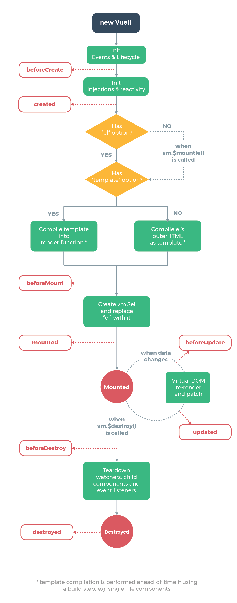

# Vue

* [Life Cycle](##Vue Life Cycle)
* [Settings](##Settings)
* 

## Vue Life Cycle

* beforeCreate
  * lifecylce, event, render 초기화 된 후
* created
  * injection, state, proive 초기화된 후 (initState)
  * component로 접근하는 this의 요소들, data, props, method, computed 초기화 하기 때문에 접근할 수 있다
* beforeMount
  * templete 의 여부를 확인후 렌더링, 가상 DOM 이 생성되어있으나 실제 DOM에 부착되지 않은 상태이다
* mounted
  * DOM 삽입 단계 ( $el )
* beforeUpdate
  * DOM이 재 렌더링되고 패치되기 직전,
* updated
  * DOM이 업데이트를 완료된 상태이므로 종속적인 연산 가능
* beforeDestory
  * Component 가 Destory되기 전, Component의 js function 들을 제거해줄때 주로 사용
* destroyed

## Settings

