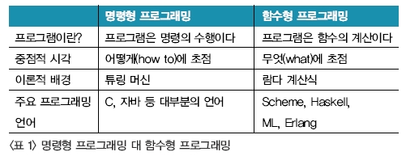

# 함수형 프로그래밍

> functional_programming

# 프로그래밍 패러다임

프로그래밍 패러다임은 프로그래머에게 프로그래밍의 관점을 갖게하고 결정하는 역할을 한다.

- 명령형 프로그래밍: 프로그래밍의 상태와 상태를 변경시키는 구문의 관점에서 연산을 설명하는 방식
  - 절차지향 프로그래밍: 수행되어야 할 연속적인 계산 과정을 포함하는 방식 (C, C++)
  - 객체지향 프로그래밍: 객체들의 집합으로 프로그램의 상호작용을 표현 (C++, Java, C#)
- 선언형 프로그래밍: 어떤 방법으로 해야 하는지(How)를 나타내기보다 무엇(What)과 같은지를 설명하는 방식
  - 함수형 프로그래밍: 순수 함수를 조합하고 소프트웨어를 만드는 방식 (클로저, 하스켈, 리스프)

## 명령형과 선언형의 프로그래밍 비교

- 명령형: 알고리즘을 명시하고 목표는 명시 안함.
- 선언형: 알고리즘 명시하지 않고 목표만 명시.

**"명령형 프로그래밍은 어떻게 할 것인가(How)를 표현하고, 선언형 프로그래밍은 무엇을 할 것인가(What) 표현한다."**

## 함수형 프로그래밍에 필요한 개념

### 1급 객체 (First Object, 또는 1급 시민)

- 1급 객체(First class object)란 다음과 같은 조건을 만족하는 객체
  - 변수나 데이터 구조안에 담을 수 있다.
  - 파라미터로 전달 할 수 있다.
  - 반환값(return value)으로 사용할 수 있다.
  - 할당에 사용된 이름과 관계없이 고유한 구별이 가능하다.
  - 동적으로 프로퍼티 할당이 가능하다.

### 고차 함수 (High-Order Function)

- 람다 계산법에서 만들어진 용어로 아래 조건을 만족하는 함수
  - 함수에 함수를 파라미터로 전달할 수 있다.
  - 함수의 반환값으로 함수를 사용할 수 있다.

### 불변성 (Immutablility)

- 함수형 프로그래밍에서는 데이터가 변할 수 없는데, 이를 불변성 데이터라고 한다. (자바스크립트는 가능하지만 불가능한 언어들이 있다)

- 데이터 변경이 필요한 경우, 원본 데이터 구조를 변경하지 않고 그 데이터를 복사본을 만들어 그 일부를 변경하고, 변경한 복사본을 사용해 작업을 진행한다.

  

### 순수 함수 (Pure function)

- 순수 함수란 함수형 프로그래밍에 필요한 개념으로 아래 조건을 만족하는 함수를 뜻한다.
  - 동일한 입력에는 항상 같은 값을 반환해야 한다.
  - 함수의 실행은 프로그램의 실행에 영향을 미치지 않아야 한다. (Side effect 가 없어야 한다)
    - 예를 들어, 함수 내부에서 인자의 값을 변경하거나 프로그램 상태를 변경하는 것